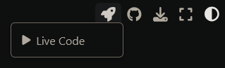

# User Guide

## How to use this book

### Validation

TODO

### Verification

Each verification case was created using either the [`MES`](./verification/methods.md/#method-of-exact-solutions-mes) or [`MMS`](./verification/methods.md/#method-of-manufactured-solutions-mms) and are tagged accordingly.

TODO

### Navigating tags

Each case is tagged and tag's cases can be navigated through the [🏷 Tags](./_tags/tagsindex.md) index.

* [1D](./_tags/1d.md) : One-dimensional simulations.
* [2D](./_tags/2d.md) : Two-dimensional simulations.
* [`MES`](./_tags/mes.md) : Cases using the [`MES`](./verification/methods.md/#method-of-exact-solutions-mes)
* [`MMS`](./_tags/mms.md) : Cases using the [`MMS`](./verification/methods.md/#method-of-manufactured-solutions-mms).
* ...

### Executing and editing code

Press the Live Code button on the toolbar to edit and run the code. \


```{note}
This might take a while to load after new releases of the book.
```

## How to Contribute

All V&V cases are tracked as markdown files in the [\{MyST\}NB](https://myst-nb.readthedocs.io/en/latest/) format, which allows
us to use useful [MyST directives](https://myst-parser.readthedocs.io/en/latest/syntax/roles-and-directives.html) and track the code in the same raw text file.

### Adding a case

1. Create a [Jupyter notebook](https://jupyter-notebook-beginner-guide.readthedocs.io/en/latest/what_is_jupyter.html) for editing the case.

2. Run [`jupytext --set-formats ipynb,myst`](https://jupytext.readthedocs.io/en/latest/using-cli.html) on the `.ipynb` notebook file. This creates a ["paired"](https://jupytext.readthedocs.io/en/latest/paired-notebooks.html) markdown file which we will be tracking on git.

3. Add to ToC TODO

#### Coding Guidelines

TODO

#### Final Touches

TODO make this section into a note with a title

1. Add tags by using the [\{tags\}](https://sphinx-tags.readthedocs.io/en/latest/quickstart.html#usage) directive below the case title:

    ``````md
    ```{tags} tag1, tag2
    ```
    ``````

2. Add ["hide"](https://myst-nb.readthedocs.io/en/latest/render/hiding.html) tags to the code cells in the case where appropriate. Ideal visible outputs only contain figures.
3. Format the code using [black](https://pypi.org/project/black/) on the notebook file.

### Editing a case

1. run [`jupytext --sync`](https://jupytext.readthedocs.io/en/latest/using-cli.html) on the markdown file,
2. make edits
3. run [`jupytext --sync`](https://jupytext.readthedocs.io/en/latest/using-cli.html) again to update both files
4. commit
